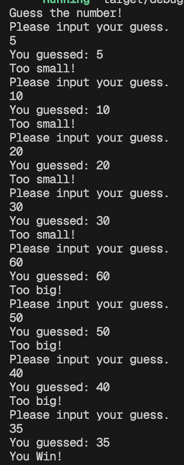

# Guessing Game

A guessing game from the book: The Rust Programming Language.

Below shows image of how the guessing game is played.

The user first guesses a number and then is told if it is too big or small. Going off of that information the user will then guess again until they narrow down and guess exactly what the number is. When the exact number is guessed, the game ends.

